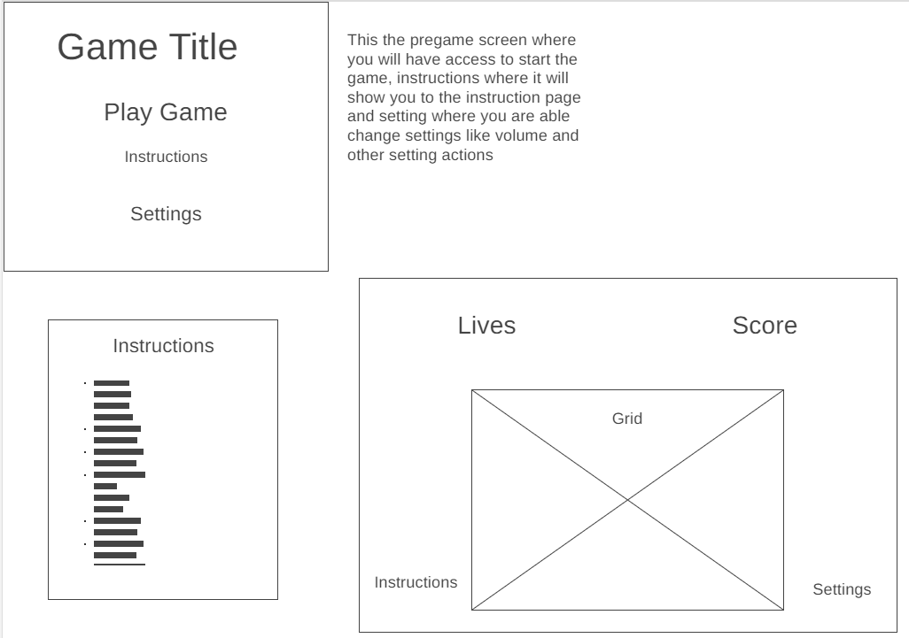

# Detonator Dash

## Background

Detonator Dash is an exciting grid-based game where players aim to achieve a high score by collecting coins and keys while avoiding hidden bombs. The game consists of a grid with various elements, including coins, keys, bombs, and power-ups. Players must strategically click on tiles to reveal coins and keys, earning points for each collected coin and key. However, clicking on a bomb ends the game. The challenge increases with each level as the grid expands, and is populated randomly with more bombs.

## Functionality & MVPs

In Detonator Dash, users will be able to:

1. Reveal tiles on the grid by clicking on them.
2. Collect coins for 10 points each and keys for 50 points.
3. Receive visual cues (blue or red color) indicating proximity to the key when clicking on a coin.
4. Encounter hidden power-ups that enhance gameplay.
5. Progress through levels with increasing difficulty and larger grids.
6. View the number of lives and the current score.

Additionally, the project will include:

- **Instructions & README:**
  - Detailed instructions on gameplay and controls.
  - A comprehensive README file providing information about the project.

- **Power-ups:**
  - Implementation of hidden power-ups that provide special abilities to the player.

- **Dynamic Grids:**
  - The grid dynamically adjusts its size and the number of bombs as the player progresses through levels.

## Wireframes

## Technologies, Libraries, APIs

The project will use the following technologies, libraries, and APIs:

- **JavaScript:**
  - For game logic and interactivity.

- **HTML5 Canvas API:**
  - For rendering the game grid and visual elements.

- **CSS:**
  - For styling the game interface.

- **GitHub Pages:**
  - To deploy the game online.

- <a target="_blank" href="https://icons8.com/icon/EJum2jug7UZq/bank">Bank</a> icon by <a target="_blank" href="https://icons8.com">Icons8</a>
- <a target="_blank" href="https://icons8.com/icon/TT4FFC7dCuDO/bank-safe">Bank Safe</a> icon by <a target="_blank" href="https://icons8.com">Icons8</a>

## Implementation Timeline

### Friday Afternoon & Weekend

- **Set Up Repository:**
  - Create local and remote repositories.
  - Structure the project folders.

- **Basic HTML and CSS:**
  - Set up the HTML structure.
  - Apply initial styling using CSS.

### Monday

- **Game Grid and Tiles:**
  - Implement the grid using the HTML5 Canvas API.
  - Define different tile types (coins, keys, bombs).

- **Tile Click Functionality:**
  - Add functionality to reveal tiles upon clicking.

### Tuesday

- **Scoring System:**
  - Implement scoring logic for coins and keys.

- **Proximity Indicator:**
  - Add visual cues (blue/red) for proximity to the key when clicking on coins.

### Wednesday

- **Power-ups:**
  - Integrate hidden power-ups with unique effects.

- **Dynamic Grid:**
  - Implement dynamic grid resizing and bomb addition for increasing difficulty.

### Thursday Morning

- **Lives Display:**
  - Display the number of lives remaining.

- **README:**
  - Write detailed instructions and information in the README file.

### Presentation & Deployment

- **Prepare Presentation:**
  - Practice the presentation.
  - Prepare visuals for the presentation.

- **Deploy to GitHub Pages:**
  - Deploy the game online using GitHub Pages.

This timeline provides a structured plan for the development of Detonator Dash, ensuring a smooth and organized progression throughout the project. Adjustments can be made based on the actual progress during each phase of development.
