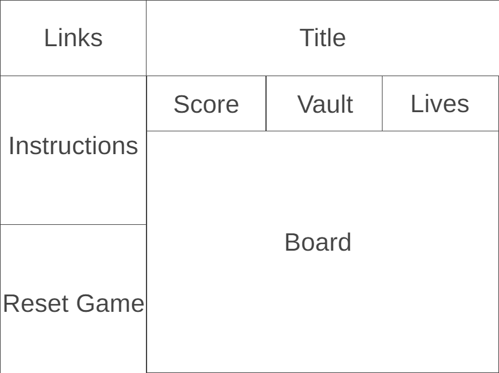

# Detonator Dash

## Background

Welcome to Detonator Dash, an exhilarating grid-based game where players strive to achieve the highest score by navigating a perilous landscape filled with coins, keys, and hidden bombs. The game introduces various elements, such as cool animations, a full interactive 8 by 8 grid, and strategic challenges that keep players on the edge of their seats.

https://almoe099.github.io/Detonator-Dash/ 


## Wireframes



## Functionality & MVPs

In Detonator Dash, users can expect the following features:

1. **Tile Interaction:**

   - Reveal tiles on the grid with strategic clicks.

2. **Scoring Mechanism:**

   - Collect coins for 10 points each, diamonds near keys for $25, and keys for a substantial $50.

3. **Visual Cues:**

   - Receive visual cues:
     - Blue indicates proximity to the key when clicking on a coin.
     - Red signifies danger—you're on a bomb.

4. **Progressive Challenges:**

   - Progress through levels with increasing difficulty and dynamically adjusting grid sizes.

5. **Scoreboard:**
   - View the number of lives and the current score to track your progress.

Additionally, the project will include:

- **Instructions & README:**
  - Detailed instructions on gameplay and controls.
  - A comprehensive README file providing information about the project.

## Instructions

Welcome to Denotator Dash, an adrenaline-pumping grid-based game that takes excitement to new heights. In this thrilling journey, players embark on a quest to achieve the highest score possible by strategically collecting coins and unlocking vaults with keys, all while navigating the treacherous landscape of hidden bombs.

The game unfolds in a grid filled with a dynamic array of elements, including coins, keys, and enticing power-ups. Your task is to strategically click on tiles, revealing coins and keys to earn points. Be on the lookout for diamonds, as tiles near the key are diamonds worth $25 each. Keys, on the other hand, are worth a whopping $50. Keep an eye out for visual cues: blue indicates you are near the key, while red signals you are on a bomb.

Brace yourself for an escalating challenge as each level expands the grid and introduces more hidden bombs. Dive into the game's strategic depth as you encounter hidden power-ups that elevate your gameplay to new heights.

Progress through levels with increasing difficulty, navigating larger grids and facing more unpredictable challenges. Keep a close eye on your number of lives and your current score—your journey through Denotator Dash is a relentless test of skill and strategy.

To play click the screen with your mouse to reveal the hidden tiles and aim for a highscore!

## Technologies, Libraries, APIs

Detonator Dash leverages the following technologies, libraries, and methods:

- **JavaScript:**
  - For game logic and interactivity.

- **CSS:**
  - For styling the game interface.

- **GitHub Pages:**
  - To deploy the game online.

## Technical Implementations

**Creating a Board:**

- Created a nested for loop to generate (64) "li" tags and appended them to my boardContainer div tag
- Need to add some styling to make the board a symmetric grid
- Then, I assigned a unique id to each "li" tag so that I could reference that specific tag

``` javascript 
  createBoard() {
    for (let r = 0; r < 8; r++) {
      for (let c = 0; c < 8; c++) {
        let tile = document.createElement("li");
        tile.dataset.posX = r;
        tile.dataset.posY = c;
        tile.setAttribute("id", r + "-" + c);
        this.boardContainer.appendChild(tile);
      }
    }
    this.updateScoreDisplay();
    this.updateVaultCount();
    this.updateLifeCount();
    this.boardContainer.addEventListener("click", this.handleClick);
  }
```

``` scss
#board {
  width: 550px;
  height: fit-content;
  border: 10px solid black;
  background-color: lightslategray;
  position: relative;
  top: 150px;
  margin: 0 auto;
  display: flex;
  flex-wrap: wrap;
}

li {
  width: 66.75px;
  height: 66.75px;
  border: 1px solid black;
  margin: 0px;
  font-size: 30px;
  display: inline-flex;
  justify-content: center;
  align-items: center;
  padding-bottom: 0px;
}
```

**Creating a Hidden Board:**

- Created a hidden board so that it wouldn't show what was behind the tiles.
- Next, randomly populated the board with 1 key and the default 20% bombs, and the rest cash
- This guaranteed the board is constantly shuffled each time.

``` javascript 
  createBoardArray() {
    if (this.bombRate === undefined) {
      this.bombRate = 0.2;
    }

    this.keyPosition = {
      row: Math.floor(Math.random() * 8),
      column: Math.floor(Math.random() * 8),
    };

    let arr = [];
    for (let i = 0; i < 8; i++) {
      const row = [];
      for (let j = 0; j < 8; j++) {
        if (i === this.keyPosition.row && j === this.keyPosition.column) {
          row.push("🗝️");
        } else {
          const randomValue = Math.random();
          const cellValue = randomValue <= this.bombRate ? "💣" : "💰";
          row.push(cellValue);
        }
      }
      arr.push(row);
    }
    return arr;
  }
```

**Creating a Reveal Board:**

- Use a nested for loop to literate over whole the board
- Next, found each li tag by it's id and added its assigned class

``` javascript 
  revealBoard() {
    for (let i = 0; i < 8; i++) {
      for (let j = 0; j < 8; j++) {
        let tile = document.getElementById(i + "-" + j);
        switch (this.boardArray[i][j]) {
          case "💰":
            if (this.nearKey(parseInt(i), parseInt(j))) {
              tile.classList.add("diamondTile");
            } else {
              tile.classList.add("cashTile");
            }
            break;
          case "🗝️":
            tile.classList.add("keyTile");
            break;
          case "💣":
            tile.classList.add("bombTile");
            break;
        }
      }
    }
  }
```

**Creating a click method:**

- Created method where the tile will change to its respected value
- Based on the tile clicked certain methods will occur
- Keys: creates a new board with greater rewards, diamond & cash: increase score, bomb: 1 life each tile
- prevented the action of clicking a tile more than twice
- create a modal pop up whenever lives equal 0

``` javascript 
  handleClick(e) {
    const dataPosValue = [
      parseInt(e.target.dataset.posX),
      parseInt(e.target.dataset.posY),
    ];

    if (
      e.target.classList.contains("diamondTile") ||
      e.target.classList.contains("cashTile") ||
      e.target.classList.contains("keyTile") ||
      e.target.classList.contains("bombTile")
    ) {
      return;
    }

    if (this.boardArray[dataPosValue[0]][dataPosValue[1]] === "💰") {
      if (this.nearKey(dataPosValue[0], dataPosValue[1])) {
        e.target.classList.add("diamondTile");
        this.score += this.diamondScore;
      } else {
        e.target.classList.add("cashTile");
        this.score += this.cashScore;
      }
    } else if (this.boardArray[dataPosValue[0]][dataPosValue[1]] === "🗝️") {
      e.target.classList.add("keyTile");
      this.score += this.KeyScore;
      this.KeyFound();
      this.vaultCount += 1;
    } else {
      e.target.classList.add("bombTile");
      this.life--;
      if (this.life === 0) {
        this.updateLifeCount();
        this.revealBoard();

        const modalContent = document.getElementById("context");
        modalContent.innerHTML = "";

        const h3Element1 = document.createElement("h3");
        const h3Element2 = document.createElement("h3");
        const h3Element3 = document.createElement("h3");
        h3Element1.textContent = "GAME OVER!!!";
        h3Element2.textContent = `Vault Number: ${this.vaultCount}`;
        h3Element3.textContent = `Your Score: $${this.score}`;
        modalContent.appendChild(h3Element1);
        modalContent.appendChild(h3Element2);
        modalContent.appendChild(h3Element3);

        const modal = document.getElementById("gameOverModal");
        modal.style.display = "flex";

        const closeModal = document.getElementById("closeModal");
        closeModal.addEventListener("click", () => {
          modal.style.display = "none";
        });

        this.boardContainer.removeEventListener("click", this.handleClick);
        return;
      }
    }
    this.updateScoreDisplay();
    this.updateLifeCount();
  }
```

**Update Score Board:**

- Created a score board that updates the current information 
- It grabs the div tag by the id and reassigns the existing information

``` javascript 
  updateScoreDisplay() {
    const score = document.getElementById("score");
    score.innerHTML = "Current Score $" + this.score;
    console.log("Score: $" + this.score);
  }

  updateVaultCount() {
    const vault = document.getElementById("vaultCount");
    vault.innerHTML = "Vault Number " + this.vaultCount;
  }

  updateLifeCount() {
    const life = document.getElementById("lifeCount");
    life.innerHTML = "Lives " + this.life;
  }
```

**Creating a Reset Button:**

- Created a button to reset the game
- Added a eventlister so the reset game is called
- The reset game method resets everything to default

``` javascript 
  createResetButton() {
    const resetButton = document.getElementById("resetGame");
    resetButton.classList.add("reset");
    resetButton.textContent = "Reset Game";
    resetButton.addEventListener("click", () => this.resetGame());
  }

  resetGame() {
    this.vaultCount = 1;
    this.score = 0;
    this.KeyScore = 50;
    this.diamondScore = 25;
    this.cashScore = 10;
    this.bombRate = 0.2;
    this.life = 3;
    this.boardArray = this.createBoardArray();
    this.boardContainer.innerHTML = "";
    this.createBoard();
    this.updateScoreDisplay();
    this.updateVaultCount();
    this.updateLifeCount();
  }
```

## Implementation Timeline

### Thursday

- **Set Up Repository:**

  - Create local and remote repositories.
  - Structure the project folders.

- **Basic HTML and CSS:**
  - Set up the HTML structure.
  - Apply initial styling using CSS.

### Friday Afternoon & Weekend

- **Game Grid and Tiles:**
  - Define different tile types (cash, diamonds, keys, bombs).

- **Tile Click Functionality:**
  - Add functionality to reveal tiles upon clicking.

### Monday

- **Scoring System:**

  - Implement scoring logic for cash, diamonds, and keys.

- **Proximity Indicator:**
  - Added visual cues (blue/diamonds) for proximity to 1 tile from the key when clicking on cash.

### Tuesday

- **Animations:**

  - Integrate tiles with unique effects.

- **Adjusting Grid Size:**
  - Implement dynamic grid resizing and bomb addition for increasing difficulty.

### Wednesday Morning

- **Lives Display:**

  - Display the number of lives remaining.

- **README:**
  - Write detailed instructions and information in the README file.

### Presentation & Deployment

- **Prepare Presentation:**

  - Practice the presentation.
  - Prepare visuals for the presentation.

- **Deploy to GitHub Pages:**
  - Deploy the game online using GitHub Pages.

This timeline provides a structured plan for the development of Detonator Dash, ensuring a smooth and organized progression throughout the project. Adjustments can be made based on the actual progress during each phase of development.

### Future Implementations

- Add music and sound effect to every indivual sound effects
- Add a Easy, Default, and Hard mode
- Add diffent grid sizes options
- Add powerups in the future

### CC Licensing:

- <a target="_blank" href="https://icons8.com/icon/TT4FFC7dCuDO/bank-safe">Bank Safe</a> icon by <a target="_blank" href="https://icons8.com">Icons8</a>
